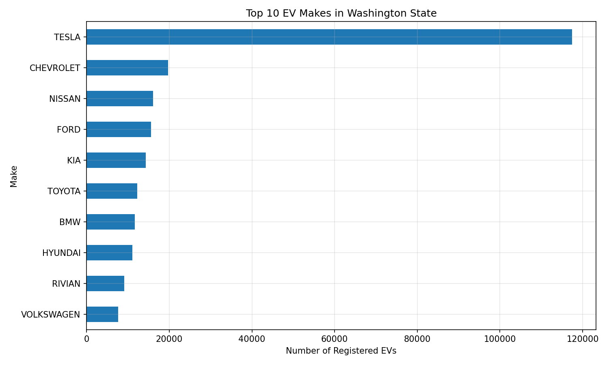
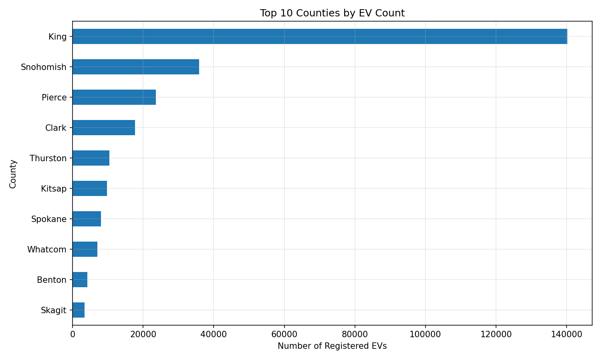
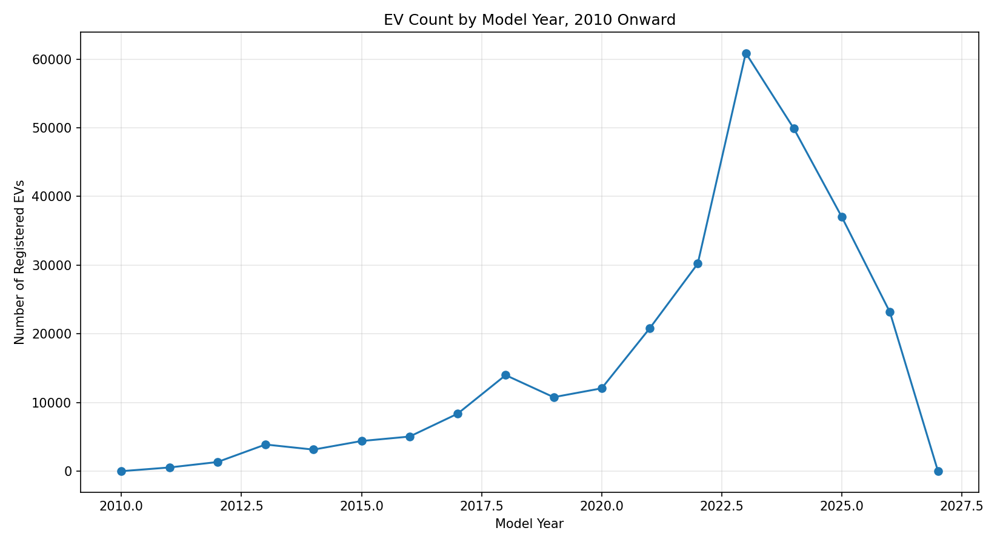
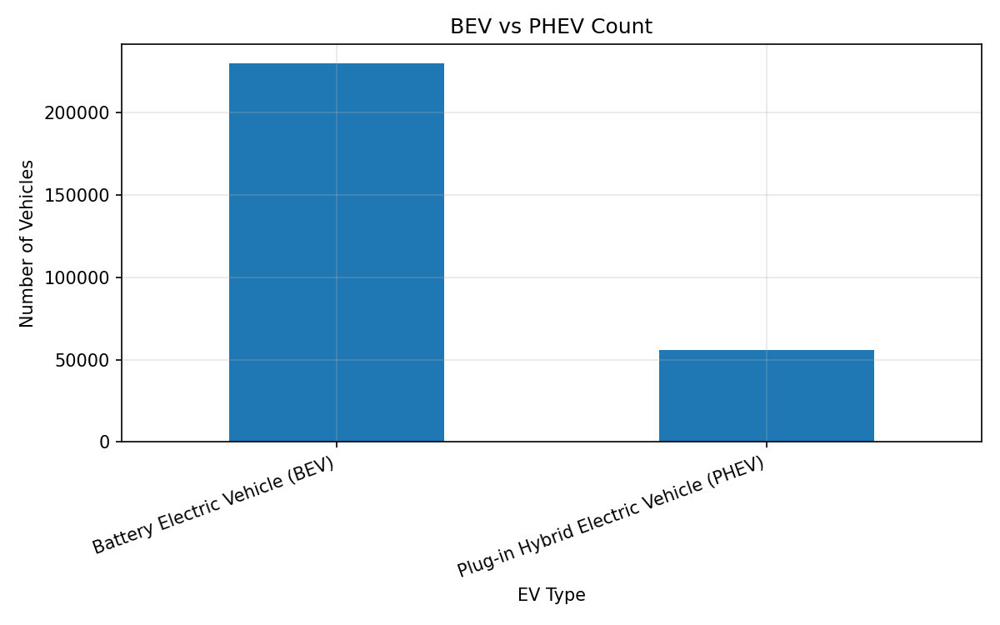

# Electric Vehicle Population Analysis

This project analyzes electric vehicle population data from Washington State using Python and SQL Server.

The goal is to understand EV registration patterns by manufacturer, model, vehicle type, model year, county, city, and electric range.

The project includes Python-based data cleaning and exploratory analysis, followed by SQL analysis using SQL Server Management Studio.

---

## Project Objectives

The main questions explored in this project are:

1. Which EV manufacturers are most common?
2. Which EV models appear most often?
3. What is the split between Battery Electric Vehicles and Plug-in Hybrid Electric Vehicles?
4. Which counties and cities have the highest number of registered EVs?
5. How does EV count vary by model year?
6. Which manufacturers have higher reported electric range?
7. What are the CAFV eligibility categories?

---

## Tools Used

- Python
- pandas
- NumPy
- Matplotlib
- Jupyter Notebook
- SQL Server
- SQL Server Management Studio

---

## Dataset

The dataset used in this project is the Washington State Electric Vehicle Population dataset.

It contains registered electric vehicle records with fields such as:

- County
- City
- State
- Postal code
- Model year
- Make
- Model
- Electric vehicle type
- CAFV eligibility
- Electric range
- Legislative district
- Electric utility

The raw dataset is not included in this repository because it may be large and can be downloaded from the public Washington State data portal.

---

## Project Workflow

### 1. Data Cleaning

Notebook: `notebooks/01_data_cleaning.ipynb`

Main steps:

- Loaded the raw EV population dataset.
- Cleaned column names.
- Checked missing values and duplicate rows.
- Selected useful columns for analysis.
- Cleaned text columns.
- Saved a cleaned CSV file for analysis.

---

### 2. Exploratory Data Analysis

Notebook: `notebooks/02_ev_population_analysis.ipynb`

Main analysis:

- Top EV manufacturers
- Top EV models
- BEV vs PHEV split
- EV count by model year
- Top counties by EV count
- Top cities by EV count
- Electric range distribution
- Average electric range by make

---

### 3. SQL Analysis

SQL file: `sql/ev_analysis_queries.sql`  
Output summary: `sql/query_outputs.md`

The cleaned EV dataset was imported into SQL Server and analyzed using SQL Server Management Studio.

Main SQL questions:

- Which EV manufacturers are most common?
- Which EV models are most common?
- What is the BEV vs PHEV split?
- Which counties and cities have the most EVs?
- How does EV count vary by model year?
- Which manufacturers have the highest average reported electric range?
- What are the CAFV eligibility categories?

---

## Selected Visuals

### Top EV Makes



### Top Counties by EV Count



### EV Count by Model Year



### BEV vs PHEV Count



---

## Key Insights

- EV registrations are concentrated among a small number of major manufacturers.
- Battery Electric Vehicles appear more frequently than Plug-in Hybrid Electric Vehicles.
- EV registrations are concentrated in certain counties and cities.
- Recent model years have much higher EV counts than older model years.
- Electric range analysis requires care because some records report range as zero or missing.

---

## Limitations

- The dataset represents registered EVs in Washington State, not global EV sales.
- Model year is not the same as registration year.
- Electric range values may be missing or reported as zero for some vehicles.
- This project is exploratory and does not build a predictive model.

---

## Repository Structure

```text
Electric-Vehicle-Population-Analysis/

README.md
requirements.txt
.gitignore

notebooks/
    01_data_cleaning.ipynb
    02_ev_population_analysis.ipynb

sql/
    ev_analysis_queries.sql
    query_outputs.md

images/
    top_ev_makes.png
    top_counties_ev_count.png
    ev_count_by_model_year.png
    bev_vs_phev_count.png
    
